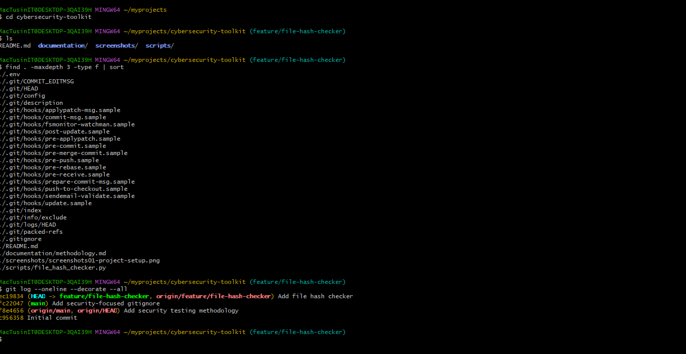
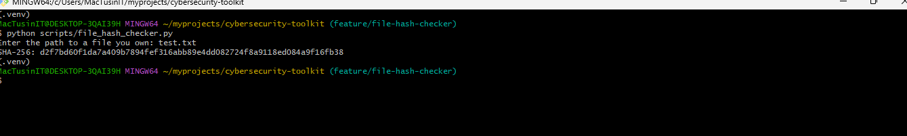
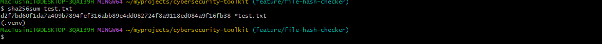

# Cybersecurity Toolkit

A hands-on cybersecurity toolkit for authorized security testing, defensive security research, and cybersecurity learning.

## Overview

This project contains practical cybersecurity utilities developed to demonstrate security concepts through hands-on experimentation.

The current implementation includes a **SHA-256 File Hash Checker** that calculates the SHA-256 cryptographic hash of a file.

The project is developed and tested in a controlled local environment.

## Features

- Calculate SHA-256 hashes of files
- Verify file integrity using cryptographic hashes
- Read files in binary mode for accurate hashing
- Compare generated hashes with an independent hashing utility
- Document hands-on security testing results

## Lab Environment

| Component | Configuration |
|---|---|
| Operating System | Windows 11 |
| Terminal | Git Bash |
| Python | 3.14.7 |
| Python Environment | `.venv` virtual environment |
| Test Target | Local test file |
| Network Scope | Local system |
| Authorization | Self-owned test environment |

## Project Structure

```text
cybersecurity-toolkit/
│
├── README.md
│
├── documentation/
│
├── screenshots/
│   ├── 01-project-structure.png
│   ├── 02-file-hash-checker.png
│   └── 03-hash-verification.png
│
└── scripts/
    └── file_hash_checker.py
```

## Installation

Clone the repository:

```bash
git clone https://github.com/samolutusin/cybersecurity-toolkit.git
```

Navigate into the project:

```bash
cd cybersecurity-toolkit
```

Create a Python virtual environment:

```bash
python -m venv .venv
```

Activate the virtual environment in Git Bash on Windows:

```bash
source .venv/Scripts/activate
```

Verify Python:

```bash
python --version
```

Example:

```text
Python 3.14.7
```

### Dependencies

The current file hash checker uses Python standard-library modules and therefore does not require a `requirements.txt` file.

The implementation uses:

- `hashlib`
- `pathlib`

## Usage

Run the file hash checker:

```bash
python scripts/file_hash_checker.py
```

The program will ask for the path to a file:

```text
Enter the path to a file you own:
```

For testing, a local file can be provided:

```text
test.txt
```

Example output:

```text
SHA-256: ddbd2a0966580d824367784e7bf2a625bf2dfbc0024a2819745cf20193fd191f
```

## Hands-on Demonstration

The following screenshots document the actual local testing performed on this project.

### 1. Project Structure

The repository structure was inspected before executing the file hash checker.



### 2. File Hash Checker Execution

The SHA-256 file hash checker was executed against a locally created test file.



### 3. Independent Hash Verification

The SHA-256 value generated by the Python implementation was independently verified using `sha256sum`.



## Testing Results

| Test | Target | Expected Result | Actual Result | Status |
|---|---|---|---|---|
| SHA-256 calculation | `test.txt` | Generate SHA-256 hash | Hash generated successfully | PASS |
| Hash verification | `test.txt` | Independent hash matches | Hash matched `sha256sum` | PASS |

### Verified SHA-256

The SHA-256 hash generated during testing was:

```text
ddbd2a0966580d824367784e7bf2a625bf2dfbc0024a2819745cf20193fd191f
```

## Security Testing Methodology

This project follows a controlled and authorized testing approach:

1. Define the testing scope.
2. Use systems, files, and environments that are owned by the tester or explicitly authorized for testing.
3. Perform the intended security test.
4. Collect relevant evidence.
5. Analyze the results.
6. Document the outcome.
7. Re-test where applicable.

For this demonstration, testing was performed against a local test file.

## Responsible Use

This project is intended for:

- Cybersecurity education
- Defensive security research
- Authorized security testing
- Controlled laboratory experimentation

Do not use this toolkit against systems, files, networks, or applications without appropriate authorization.

## Limitations

The current implementation is focused on SHA-256 file hashing and file-integrity verification.

It is not currently a complete vulnerability scanner or full security assessment framework.

Additional cybersecurity utilities may be added as the project develops.

## Lessons Learned

This project provided practical experience with:

- Python file handling
- SHA-256 cryptographic hashing
- File integrity verification
- Python virtual environments
- Git and GitHub workflows
- Hands-on testing
- Security evidence collection
- Technical documentation

## Author

**Samuel Olutusin**

Cybersecurity | Information Security | Security Research

GitHub: [samolutusin](https://github.com/samolutusin)
